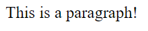

# HTML Element

Describes that anything we can use to display things on the webpage

# Syntax

Rules for writing code. it's basically just grammar but for code.

# Tags

## Tag Name

like `button` in the HTML tag `<button>`

## Opening Tag

`<button>`

## Closing Tag

`</button>`

# Anchor Element `<a>`

Link to another website.

# HTML Attribute

Modified _how_ an element behaves

For example, the `href` attribute in the anchor element. It redirects us to another website. It modified _how_ the anchor element behaves.

You must have a space between the tag name and the html attribute.

For example:

```html
<a href="">Link to YouTube</a>
```

The `href` in this element is called the **attribute name** and the value (in double quotes: `""`) is called the **attribute value**.

Another attribute for the anchor element is the `target` attribute. It tells us whether we want to open the site in a new page or not. (Of course these are simple definitions and are probably wrong, but good for a beginner)

```html
<a href="https://www.youtube.com/" target="_blank">Link to YouTube</a>
```

The `_blank` attribute value for the attribute `target` tells us to open the link in a new tab.

The `target` and `href` attributes are not in the elements `<button>` or `<p>`. They have their own set of attributes.

> tldr: Attributes are modifications to a HTML element.

# Spaces

Extra spaces in HTML code are ignored. (1)

Extra new lines are also ignored. (2)

Examples:

(1)

```html
<p>This is a                                        paragraph!</p>
```

Result:


<hr>
(2)

```html
<p>
    This is a paragraph!
</p>
```

Result:


<hr>

As you can see, there is no difference.

(Make sure to add indents if you are opting to use (2). It helps with distinguishing content vs tags)